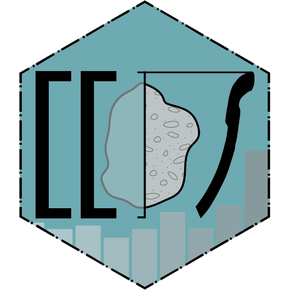

# idaifieldR	<a href='https://lsteinmann.github.io/idaifieldR/'></a>


<!-- badges: start -->
[](https://github.com/lsteinmann/idaifieldR/actions/workflows/R-CMD-check.yaml)
[](https://codecov.io/gh/lsteinmann/idaifieldR?branch=main)
[](https://github.com/lsteinmann/idaifieldR/releases)
[](https://github.com/lsteinmann/idaifieldR/releases)
[](https://lsteinmann.github.io/idaifieldR/)
<!-- badges: end -->


idaifieldR imports data from the [iDAI.field 2 / Field Desktop database](https://github.com/dainst/idai-field) into R. The core functions of this package use the [CouchDB-API](https://docs.couchdb.org/en/stable/api/database/index.html) with [crul](https://cran.r-project.org/web/packages/crul/index.html) to connect to a running iDAI.field 2 or 3 (Field Desktop) client and store the whole database or a subset in a list in R (in memory), avoiding the csv-export that would otherwise be needed and gathering all documents at once, which is not possible with said csv-export. Any R-Script using idaifieldR to import the database can be re-run and updated with new data flexibly without exporting from the Field client itself. 

The exports can be automatically formatted for easier processing in R (e.g. UUIDs are replaced with the appropriate identifiers, lists are somewhat unnested, and the geometry is reformatted to be usable with the [sp](https://cran.r-project.org/web/packages/sp/index.html)-package). See the Demo-Vignette for more info. However, processing all resources from the database is very slow for larger databases and uses up a lot of memory. 

## Dependencies

idaifieldR needs a syncing [iDAI.field/Field Desktop-Client](https://github.com/dainst/idai-field) on the same computer or in the same network to work. Other than that, the package depends on [crul](https://cran.r-project.org/web/packages/crul/index.html) and [jsonlite](https://cran.r-project.org/web/packages/jsonlite/index.html), both available on CRAN and automatically installed as dependencies. 

## Installation

You can install the current version of idaifieldR from github using `devtools` or `remotes`:

``` r
devtools::install_github("lsteinmann/idaifieldR", build_vignettes = TRUE)
# OR
remotes::install_github("lsteinmann/idaifieldR", build_vignettes = TRUE)
```

## Example / Basic 

This is a basic example which shows you how to use idaifieldR. See the Demo.Rmd-vignette (`browseVignettes("idaifieldR")`) for a bit more explanation or the TLDR.Rmd-vignette for a very short example. 

In the example below, we connect to the project "rtest" with `connect_idaifield()` and get an index with only a few fields that every resource has with `get_field_index()`. After that, all resources (docs) from the database are imported into a single list of lists with `get_idaifield_docs()`. This contains metadata about changes and the users that made them as well. This may take rather long, use up much RAM, and is not always reasonable to work with. A better option is to query the database directly, getting all resources of category pottery using `idf_query()`. In the next step, `simplify_idaifield()` transforms the nested list into a more usable format, replacing the UUIDs with identifiers, and converting, e.g., the dating fields to minimum and maximum values. If a configuration is available, variables from checkbox-fields are also converted to multiple columns with boolean values. `idaifield_as_matrix()` will produce a matrix, where every row is a database entry (a resource) and every column a field, or a value from a checkbox field. The matrix can easily be coerced to a data.frame. 


``` r
library(idaifieldR)
# Connect to iDAI.field:
conn <- connect_idaifield(pwd = "hallo", project = "rtest")

# Get an index of the projects database:
index <- get_field_index(conn)

# Get all docs from the projects database:
idaifield_docs <- get_idaifield_docs(conn)

# Get only the docs of category "Pottery" from the database:
pottery <- idf_query(conn, field = "category", value = "Pottery")

# Simplify the nested list: 
pottery <- simplify_idaifield(pottery, uidlist = index)

# Convert it into a matrix:
pottery_mat <- idaifield_as_matrix(pottery)

# Look at the result:
View(pottery_mat)
```

