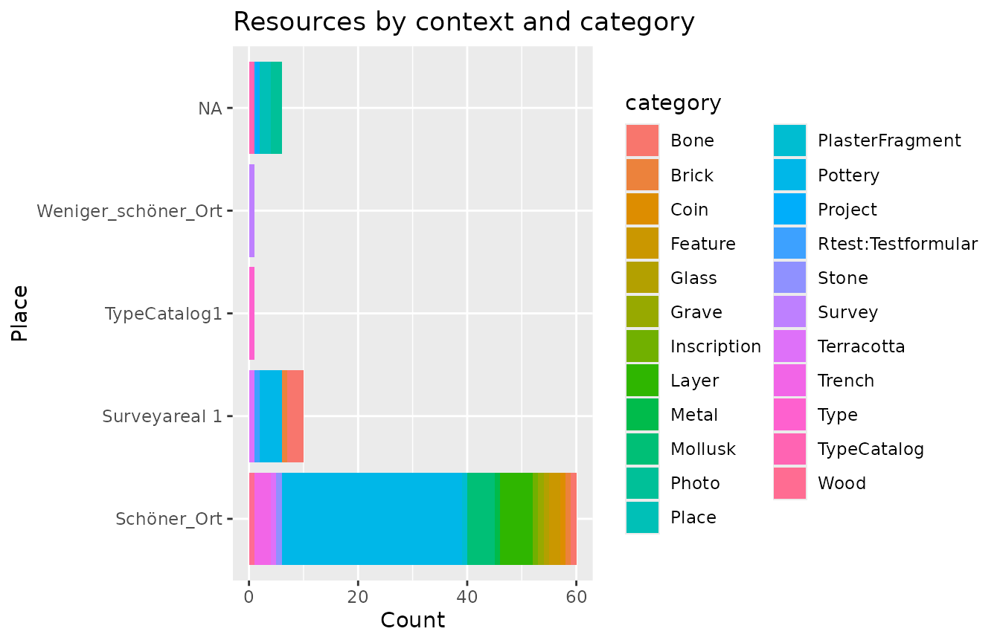
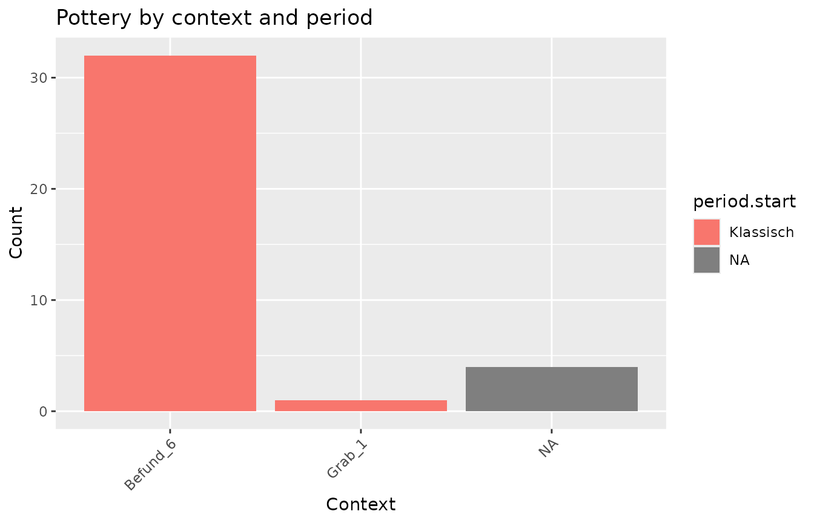
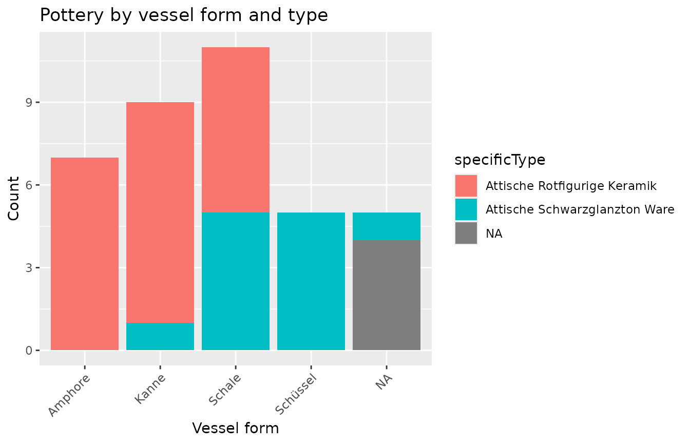

# How to use idaifieldR: Detailed Workflow

`idaifieldR` imports data from [iDAI.field / Field
Desktop](https://github.com/dainst/idai-field) directly into R via the
CouchDB API. This eliminates the need for CSV exports and allows scripts
to be re-run and updated whenever the database changes.

## Installation

`idaifieldR` is not yet on CRAN. Install it from GitHub using `remotes`:

``` r
remotes::install_github("lsteinmann/idaifieldR")
library(idaifieldR)
```

## Connecting and Loading Data

To follow along with this tutorial, load the test dataset bundled with
the package into a new Field Desktop project called `rtest`. The import
file is located at
[`inst/testdata/rtest.jsonl`](https://github.com/lsteinmann/idaifieldR/blob/main/inst/testdata/rtest.jsonl)
on GitHub.

Create a connection object with
[`connect_idaifield()`](https://lsteinmann.github.io/idaifieldR/reference/connect_idaifield.md):

``` r
conn <- connect_idaifield(pwd = "hallo", project = "rtest")
```

You can also ping the database to see if the connection succeeds:

``` r
idf_ping(conn)
```

If Field Desktop is running on the same computer, the `serverip`
argument can be left at its default (`"localhost"`). The `pwd` argument
is the password set in Field Desktop under *Tools \> Settings \> Your
password*.

Load the complete project database into R:

``` r
idaifield_test_docs <- get_idaifield_docs(connection = conn)
```

The result is a named list of class `idaifield_docs` — one element per
resource, named by identifier, reflecting the original JSON structure.
Loading the whole database at once can be slow and memory-intensive for
large projects; see the [Queries](#queries) section for a more targeted
approach.

## Building an Index

The index maps UUIDs to human-readable identifiers and is used by
[`simplify_idaifield()`](https://lsteinmann.github.io/idaifieldR/reference/simplify_idaifield.md)
to make relations readable. Generate it with
[`get_field_index()`](https://lsteinmann.github.io/idaifieldR/reference/get_field_index.md):

``` r
index <- get_field_index(conn, verbose = TRUE, gather_trenches = TRUE)
```

With `verbose = TRUE` the index also includes the `shortDescription`.
With `gather_trenches = TRUE` the `Place` column is added, which
contains the nearest *Place*-category resource (if any). Use
`head(index)` to inspect it, or plot a quick overview of the dataset:

``` r
index |>
  ggplot(aes(y = Place, fill = category)) +
  geom_bar() +
  labs(title = "Resources by context and category", y = "Place", x = "Count")
```



## Unnesting (Optional)

[`get_idaifield_docs()`](https://lsteinmann.github.io/idaifieldR/reference/get_idaifield_docs.md)
returns the raw nested structure as it comes from the API, containing
the complete revision history for each resource. You can reduce it to
the resource level with
[`maybe_unnest_docs()`](https://lsteinmann.github.io/idaifieldR/reference/maybe_unnest_docs.md):

``` r
idaifield_test_resources <- maybe_unnest_docs(idaifield_test_docs)
```

This step is optional — all `idaifieldR` functions handle both
`idaifield_docs` and `idaifield_resources` lists. The unnested version
takes up less memory and is easier to browse in RStudio.

## Simplifying the Data

[`simplify_idaifield()`](https://lsteinmann.github.io/idaifieldR/reference/simplify_idaifield.md)
transforms the nested list structure into something more R-friendly:

- Relations are flattened into named vectors with a `relation.`-prefix
  (e.g. `relation.liesWithin`)
- UUIDs in relations are replaced with human-readable identifiers
- Geometry is kept as a GeoJSON string if `keep_geometry = TRUE`
- Single level lists are flattened to vectore, but more complex fields
  are preserved as-is.

You need to supply the `index` of the **complete** project database
here, even if you are working with a subset — it is used as a lookup
table for UUID replacement. You also need to supply the project
`config`:

``` r
config <- get_configuration(conn)
```

``` r
idaifield_test_simple <- simplify_idaifield(
  idaifield_test_resources,
  index        = index,
  config       = config,
  keep_geometry = TRUE
)
```

The result has class `idaifield_simple`. The connection and project name
are stored as attributes and carried through for later use. Check them
with `attributes(idaifield_test_simple)`.

## Selecting Resources

Use
[`idf_select_by()`](https://lsteinmann.github.io/idaifieldR/reference/idf_select_by.md)
to filter the simplified list by any field:

``` r
pottery <- idf_select_by(idaifield_test_simple, by = "category", value = "Pottery")
```

## Queries

Alternatively, query the database directly instead of loading everything
first. This is useful for large projects where you only need a small
subset:

``` r
pottery_docs <- idf_query(conn, field = "category", value = "Pottery")

# Always supply the index of the complete database when simplifying a subset
pottery_simple <- simplify_idaifield(pottery_docs, index = index, config = config, keep_geometry = TRUE)
```

See also
[`?idf_index_query`](https://lsteinmann.github.io/idaifieldR/reference/idf_index_query.md)
and
[`?idf_json_query`](https://lsteinmann.github.io/idaifieldR/reference/idf_json_query.md)
for more targeted queries.

## Converting to a Data Frame

Convert the simplified list to a matrix and then a data frame with
[`idaifield_as_matrix()`](https://lsteinmann.github.io/idaifieldR/reference/idaifield_as_matrix.md):

``` r
pottery_df <- idaifield_as_matrix(pottery) |>
  as.data.frame()
```

From here, standard R and `ggplot2` workflows apply:

``` r
pottery_df |>
  ggplot(aes(x = relation.liesWithin, fill = period.start)) +
  geom_bar() +
  labs(title = "Pottery by context and period",
       x = "Context", y = "Count") +
  theme(axis.text.x = element_text(angle = 45, hjust = 1))
```



``` r
pottery_df |>
  ggplot(aes(x = vesselForm, fill = specificType)) +
  geom_bar() +
  labs(title = "Pottery by vessel form and type",
       x = "Vessel form", y = "Count") +
  theme(axis.text.x = element_text(angle = 45, hjust = 1))
```



## Geometry

Geometry is kept as a GeoJSON string when `keep_geometry = TRUE` in
[`simplify_idaifield()`](https://lsteinmann.github.io/idaifieldR/reference/simplify_idaifield.md).
To convert to an `sf` object for spatial analysis:

``` r
library(sf)
geom <- sf::st_read(pottery_simple$Befund_6_KER_4$geometry)
plot(geom)
```

Please note that you will need to set the CRS manually.

## Working with the Raw List

If the matrix format does not suit your analysis, work directly with the
`idaifield_resources` or `idaifield_simple` list. Each element is a
named list corresponding to one resource — extract fields directly,
apply your own [`lapply()`](https://rdrr.io/r/base/lapply.html)
transformations, or use `purrr` to reshape the data as needed.
