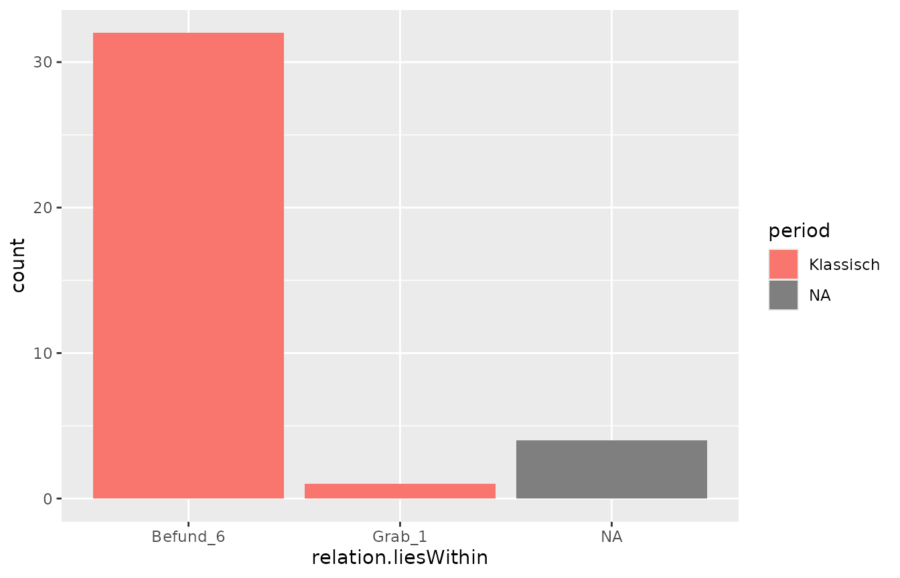

# How to use this package: Detailed Workflow

The `idaifieldR`-package is a tool for importing data from the
[iDAI.field / Field Desktop](https://github.com/dainst/idai-field)
database into R. Its core functions establish a connection to a running
iDAI.field 2 or 3 (Field Desktop) client through its API and retrieve
the entire project database or a subset of it into a list in R memory.
This eliminates the need for exporting data to CSV files, which can be
time-consuming and limiting, and allows for the retrieval of all
documents at once. Scripts can be re-run and updated with new data
flexibly.

One of the key features of **idaifieldR** is its ability to clean and
format the imported data for easier processing in R. The
[`simplify_idaifield()`](https://lsteinmann.github.io/idaifieldR/reference/simplify_idaifield.md)
function, for example, can replace UUIDs with appropriate identifiers,
reformat geometry for use with R-packages like
[sp](https://cran.r-project.org/web/packages/sp/index.html), and select
preferred language inputs for multi-language fields, among other tasks.
However, it’s important to keep in mind that processing large databases
can be slow and memory-intensive.

### Installation

To use `idaifieldR`, you’ll need to install it from GitHub since it is
not yet available on CRAN. You can download the current release from the
[idaifieldR-GitHub
page](https://github.com/lsteinmann/idaifieldR/releases) and [install
from the
file](https://riptutorial.com/r/example/5556/install-package-from-local-source).
Alternatively, you can use either the `devtools` or `remotes` package to
install it directly from GitHub.

Here’s an example of installing and loading `idaifieldR` using
`remotes`:

``` r
require(remotes)
remotes::install_github("lsteinmann/idaifieldR")

library(idaifieldR)
```

### Loading the Database and Creating an Index

To follow along with this tutorial using the same data, you can load the
backup file located at
‘[inst/testdata/rtest.jsonl](https://github.com/lsteinmann/idaifieldR/blob/main/inst/testdata/rtest.jsonl)’
from the GitHub repository into a new project called ‘rtest’ in your
Field Client. This demo dataset uses a slightly customized project
configuration to demonstrate relevant functions.

To load the complete database and create an object to serve as an index
for further processing, you need to create a connection object that
contains all the information R needs to connect to the Field Desktop
database server. This can be done using the following code:

``` r
conn <- connect_idaifield(serverip = "127.0.0.1", 
                          pwd = "hallo",
                          project = "rtest")
```

This code will ping the database and check if the connection is working.
If you are using Field Desktop on the same computer, you may not need
the `serverip` argument, as it defaults to the common localhost address.
Enter the password that is set in your Field Desktop-Client under
‘Tools/Werkzeuge’ \> ‘Settings/Einstellungen’: ‘Your password’/‘Eigenes
Passwort’ as `pwd`. `project` corresponds to the name of the project you
want to work with. For more information and additional arguments, please
see the documentation:

``` r
?connect_idaifield
```

To load the complete ‘rtest’-dataset into R, we can use the
[`get_idaifield_docs()`](https://lsteinmann.github.io/idaifieldR/reference/get_idaifield_docs.md)
function and the connection object `conn` that we created earlier:

``` r
idaifield_test_docs <- get_idaifield_docs(connection = conn)
```

This function retrieves all the documents from the project specified in
the `conn` object and stores them in a list called
`idaifield_test_docs`. Note that retrieving all the documents at once
can take some time and use up a lot of memory, especially for larger
datasets.

After loading the dataset, you can take a look at its contents using the
[`View()`](https://rdrr.io/r/utils/View.html) function in *RStudio* or
by exploring the `idaifield_test_docs` object in the Environment window.
The `idaifield_test_docs` object is a named nested list with the custom
class `idaifield_docs` that contains one element for each resource in
the database, reflecting the original JSON-structure. The name of each
list is the identifier of the associated resource.

The `doc$resource` sub-list contains the actual entry for each resource,
while the other sub-lists contain information about the changes made to
each resource along with its basic data, such as the **UUID** that Field
Desktop uses internally as the unique name of each resource. You can use
this list to visualize changes made to database entries on a time axis
sorted by users, etc., but we will continue to utilize `idaifieldR`’s
functions to work with the actual data.

The
[`check_and_unnest()`](https://lsteinmann.github.io/idaifieldR/reference/check_and_unnest.md)
function from `idaifieldR` can be used to reduce the
`idaifield_test_docs` list to the resource level. Although this step is
not necessary for further processing, it can make the data easier to
work with. You can use the following code to apply
[`check_and_unnest()`](https://lsteinmann.github.io/idaifieldR/reference/check_and_unnest.md)
to the `idaifield_test_docs` list:

``` r
idaifield_test_resources <- check_and_unnest(idaifield_test_docs)
```

For more information on
[`check_and_unnest()`](https://lsteinmann.github.io/idaifieldR/reference/check_and_unnest.md)
and its arguments, you can check out the documentation using
[`?check_and_unnest`](https://lsteinmann.github.io/idaifieldR/reference/check_and_unnest.md).
The unnested list contains only the actual data you entered in Field
Desktop, and it takes up less memory than the original nested list. You
can browse this object using `View(idaifield_test_resources)` in
RStudio, or by accessing its elements such as
`idaifield_test_resources$Befund_6_KER_18` to see the difference. This
step is done automatically by idaifieldR functions internally, so you
don’t have to worry about it.

To give you a quick overview of our data, we can generate an index of
the database by querying it using the
[`get_field_index()`](https://lsteinmann.github.io/idaifieldR/reference/get_field_index.md)
function with the connection object `conn` and the argument
`language = "en"` to set the language of the returned index to English.
This index contains only the most basic information about each object,
such as its *UUID*, its *identifier*, and its category:

``` r
index <- get_field_index(conn,
                         verbose = TRUE, 
                         language = "en")
head(index)
```

    #> The list was already unnested to resource-level.

| category | UID                                  | identifier              | isRecordedIn | liesWithin          | shortDescription | liesWithinLayer |
|:---------|:-------------------------------------|:------------------------|:-------------|:--------------------|:-----------------|:----------------|
| Layer    | 02932bc4-22ce-3080-a205-e050b489c0c2 | Befund_6                | Schnitt 1    | SE02                | NA               | NA              |
| Survey   | 031179fb-ac01-6b29-b6fc-b1b486d9bff8 | Surveyareal 1           | NA           | Weniger_schöner_Ort | NA               | NA              |
| Bone     | 0324141a-8201-c5dc-631b-4dded4552ac4 | KNOCHEN_1               | Schnitt 1    | Grab_1              | NA               | NA              |
| Pottery  | 0569d787-aa67-e105-3a27-cba29012e78e | Befund_6_KER_4          | Schnitt 1    | Befund_6            | NA               | NA              |
| Pottery  | 0860b5a5-4602-9feb-fabb-85610298bd93 | Befund_6_KER_18         | Schnitt 1    | Befund_6            | NA               | NA              |
| Mollusk  | 0cc6771c-5532-467f-90af-eb3bbd326437 | MOLLUSK_cm_meas_dimTest | Schnitt 1    | Befund_5            | DO NOT CHANGE    | NA              |

When using the
[`get_field_index()`](https://lsteinmann.github.io/idaifieldR/reference/get_field_index.md)
function with `verbose = TRUE`, it includes the field `shortDescription`
of each object from the database. By default, tries to get the English
values from multi-language fields, but you can specify the preferred
language. For example, setting `language = "de"` will display the German
language description. If the selected language does not exist, the
function will substitute another language.

To visualize the data from the index, we can use `ggplot2` and the
pipe-operator from `dplyr`. This will give us a general idea of the data
we are working with.

``` r
library(dplyr)
library(ggplot2)

index %>%
  ggplot(aes(y = liesWithin, fill = category)) + 
  geom_bar()
```


As you can see, the demo data encompasses a variety of finds, that are
recorded in different “Layers” and “Trenches”. To get to the data and
produce some more useful plots, we will now simplify our
`idaifield_test_resources`-list.

### Simplify the List

The function
[`simplify_idaifield()`](https://lsteinmann.github.io/idaifieldR/reference/simplify_idaifield.md)
takes several arguments that control the output. You can learn more
about them in the documentation
([`?simplify_idaifield`](https://lsteinmann.github.io/idaifieldR/reference/simplify_idaifield.md)).
In most cases, it should suffice to use the defaults and only pass the
imported `idaifield_docs` or `idaifield_resources` list.

``` r
idaifield_test_simple <- simplify_idaifield(idaifield_test_resources, 
                                            keep_geometry = FALSE,
                                            replace_uids = TRUE, 
                                            uidlist = index,
                                            language = "en",
                                            spread_fields = TRUE)
#> The list was already unnested to resource-level.
#> In `find_layer()`: categories considered *Layers* are: 
#>   Layer; Grave; Burial; Architecture; Floor; SurveyUnit
#>   Supply `layer_categories` argument or change the options-list: getOption("idaifield_categories")
```

The
[`simplify_idaifield()`](https://lsteinmann.github.io/idaifieldR/reference/simplify_idaifield.md)
function provides a convenient way to simplify the format of an
`idaifield_docs` or `idaifield_resources` list. By default, it tries to
use the English values from multi-language input fields, and if not
available, it uses the next available language in alphabetical order.
You can, of course, select the language of your data as well. If you
want to keep all languages from the multi-language input fields, you can
set `language = "all"`.

In addition, `keep_geometry = FALSE` removes all coordinate information
from the resources. This may be useful if you don’t need the
geographical data or want to save memory. By default, `replace_uids` is
set to `TRUE`, which replaces *UUID*s in the data with their
corresponding *identifier*s to make them more readable.

Checkbox fields and the campaign field are automatically spread across
multiple entries to later store them in multiple columns in a matrix.
This behaviour can be changed by setting `spread_fields = FALSE`.

If you process the entire database with
[`simplify_idaifield()`](https://lsteinmann.github.io/idaifieldR/reference/simplify_idaifield.md),
you don’t need to supply an index. The function will generate its own
index. However, if you only process a subset of the data, you will need
to supply an index of the complete database.

In summary,
[`simplify_idaifield()`](https://lsteinmann.github.io/idaifieldR/reference/simplify_idaifield.md)
provides several options to control the output of the data extraction.
For more information on the available options, you can consult the
documentation using the
[`?simplify_idaifield`](https://lsteinmann.github.io/idaifieldR/reference/simplify_idaifield.md)
command.

The list now has the `idaifield_simple` class. Browse the resulting list
by clicking on it in your Environment-window in RStudio or use
`View(idaifield_test_simple)`. All `idaifield_...`-objects carry the
connection and name of the project as attributes with them for later
use. You can view them with `attributes(idaifield_test_simple)`.

If you want to analyze your data in a customized way, it’s recommended
that you work directly with the `idaifield_resources`-list and extract
the information you need. However, if you prefer to have a matrix
format, `idaifieldR` provides a function that can convert the list into
a matrix. Before doing so, it’s useful to select only the resources that
are relevant to your analysis. For example, if you are only interested
in pottery, you can use the
[`idf_select_by()`](https://lsteinmann.github.io/idaifieldR/reference/idf_select_by.md)
function from idaifieldR to filter the list accordingly. The
documentation for this function can be found at
[`?idf_select_by`](https://lsteinmann.github.io/idaifieldR/reference/idf_select_by.md):

``` r
pottery <- idf_select_by(idaifield_test_simple, by = "category", value = "Pottery")
#> The list was already unnested to resource-level and simplified.
```

### Queries

The same outcome can be achieved by querying the database directly. See
the documentation of
[`?idf_index_query`](https://lsteinmann.github.io/idaifieldR/reference/idf_index_query.md),
[`?idf_query`](https://lsteinmann.github.io/idaifieldR/reference/idf_query.md)
and
[`?idf_json_query`](https://lsteinmann.github.io/idaifieldR/reference/idf_json_query.md).
This may be useful when you frequently want to update your data, but
have a large amount of resources in the database of which you only need
a small subset:

``` r
pottery_docs <- idf_query(conn, 
                          field = "category", 
                          value = "Pottery")
```

The query-functions will return `idaifield_docs`-lists that (if you so
wish) you still need to simplify. **You need to supply the index to the
`uidlist`-argument, otherwise UUIDs of relations cannot be replaced**:

``` r
pottery_simple <- simplify_idaifield(pottery_docs, uidlist = index, language = "en")
```

### Transform the Lists to a Matrix / data.frame

In both cases, you should now have an `idaifield_simple` object with 37
elements. This, we will turn into a matrix, or directly into a
data.frame to make plots easier:

``` r
pottery <- idaifield_as_matrix(pottery) %>%
  as.data.frame()
#> The list was already unnested to resource-level.
```

When viewing the resulting `Pottery`-data frame, you will notice that
the campaign-field has been converted to multiple columns. If a custom
configuration is present and can be accessed by
[`get_configuration()`](https://lsteinmann.github.io/idaifieldR/reference/get_configuration.md),
this will happen to all custom checkbox-fields, as there is no other way
to conveniently deal with such fields in a data frame. You can prevent
this by setting `spread_field = FALSE` in
[`simplify_idaifield()`](https://lsteinmann.github.io/idaifieldR/reference/simplify_idaifield.md).
To make different or better use of it, try to format the original list
itself according to your needs.

From the data frame, we can produce some basic plots and take a look at
the distribution of periods across our layers:

``` r
pottery %>%
  ggplot(aes(x = relation.liesWithin, fill = period)) + 
  geom_bar()
```



And another example:

``` r
pottery %>%
  ggplot(aes(x = vesselForm, fill = specificType)) + 
  geom_bar()
```


### Languages

There are currently two functions that will make it easier to replace
the internal names of variables with their translations in different
languages:

``` r
core_lang_list <- download_language_list(project = "core", language = "en")
milet_lang_list <- download_language_list(project = "Milet", language = "en")
```

Since these functions download the Language configuration from
[github.com/dainst/idai-field](https://github.com/dainst/idai-field/tree/master/core/config),
I would advise you to safe the result in a local RDS-file after you
prepared everything. You can prepare a lookup-table like this:

``` r
lookup <- get_language_lookup(core_lang_list, language = "en")
lookup <- rbind(lookup, get_language_lookup(milet_lang_list, language = "en"))
```

To get the translations from the Project configuration, you can get it
using
[`get_configuration()`](https://lsteinmann.github.io/idaifieldR/reference/get_configuration.md).
Please note that you need to be able to connect to the database in order
to do that. This will also give you an impression of how the
lookup-table is set up:

``` r
config <- get_configuration(conn)
lookup_conf <- get_language_lookup(config$languages, language = "en")
```

``` r
head(lookup_conf)
```

| var             | label                    |
|:----------------|:-------------------------|
| Testformular    | Test Form                |
| testCustomField | englisch testCustomField |

You can use this to manually replace values for plots. The translations
from valuelists can currently not be imported, so this only applies to
the names of fields.

## TLDR

To make a long story short and sum it up, there are two ways that you
can get all your Pottery-resources into R. The following few lines are
always necessary:

``` r
conn <- connect_idaifield(pwd = "hallo", project = "idaifieldr-demo")
db <- get_idaifield_docs(connection = conn)
index <- get_field_index(conn)
```

Using the following few lines and all default arguments while selecting
from the whole database:

``` r
pottery <- db %>%
  idf_select_by(by = "category", value = "Pottery") %>%
  # Note: simplify_idaifield() needs the index of the complete project database 
  # as a lookup-table to replace all UUIDs with their identifiers
  simplify_idaifield(uidlist = index) %>%
  idaifield_as_matrix() %>%
  as.data.frame()
```

Or using the following few lines with direct queries to the database,
see also
[`?idf_index_query`](https://lsteinmann.github.io/idaifieldR/reference/idf_index_query.md)
and
[`?idf_json_query`](https://lsteinmann.github.io/idaifieldR/reference/idf_json_query.md):

``` r
pottery <- idf_query(connection = conn,
                     project = "idaifieldr-demo", 
                     field = "category", 
                     value = "Pottery") %>%
  idaifield_as_matrix() %>%
  as.data.frame()
```
